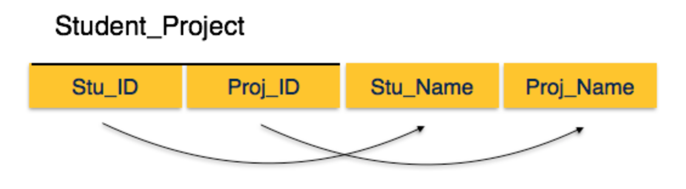
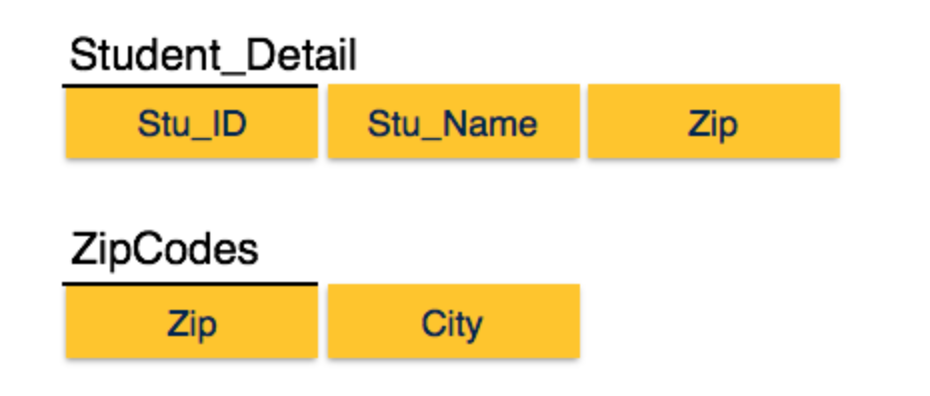

Database Normalization
======================

วัตถุประสงค์
------------
1. Normalization
2. Function dependency (FD)
3. ประเภทของ Function dependency
4. 1NF -  First Normal Form
5. 2NF -  Second Normal Form
6. 3NF -  Third Normal Form
7. BCNF - Boyce-codd Normal Form
8. 4NF - Fourth Normal Form
9. 5NF - Fifth Normal Form

1. Normalization
-----------------
 Normalization  คือวิธีการใช้ในการตรวจสอบและแก้ปัญหาทางด้านความซ้ำช้อนของข้อมูล และความผิดพลาดจากการเพิ่มหรือลบข้อมูล โดยการดำเนินการให้ข้อมูลในแต่ละ  Relation   อยู่ในหน่วยที่เล็กที่สุด ในความสัมพันธ์

* Relation schema

ในความสำพันธ์หนึ่งๆ จะอธิบายโครงสร้างของ  relation ได้จากชื่อของ relation  และ attribute ต่าง ของ relation

::

    R ( A1, A2, … An)

เช่น::

    Student ( Scode, Name, Surname, Bithday, Faculty)
    Course ( Ccode, SubjName, Credit, Instructor, Textbook)

+----------------------------+------------------------+---------------------------+-----------+-------------------------------+
|                   Scode    |                   Name |                   Surname | Birthday  |                   Faculty     |
+============================+========================+===========================+===========+===============================+
|                   20101214 |                   John |                   Harris  | 14/5/1979 |                   Engineering |
+----------------------------+------------------------+---------------------------+-----------+-------------------------------+
|                   56210121 |                   Paul |                   Martin  | 2/11/1982 |                    Management |
+----------------------------+------------------------+---------------------------+-----------+-------------------------------+
|                   4295412  |                   Lee  |                   Kevin   | 1/3/1983  |                   Science     |
+----------------------------+------------------------+---------------------------+-----------+-------------------------------+
|                   20101239 |                   Jim  |                   Jackson | 21/7/1981 |                   Letter      |
+----------------------------+------------------------+---------------------------+-----------+-------------------------------+

2. Function dependency

Functional dependency (FD) คือความสัมพันธ์ระหว่าง attribute ใน Relation โดยมีลักษณะความสัมพันธ์คือ ข้อมูลของ attribute หนึ่ง (หรือกลุ่มหนึ่ง) ขึ้นอยู่กับค่าของ attribute หนึ่ง (หรือกลุ่มหนึ่ง) อย่างเป็นฟังก์ชัน

attribute  X และ Y อยู่ใน relation R  ดังนั้น ``X -> Y``  อ่านว่า  Y ขึ้นตรงต่อ X อย่างเป็นฟังก์ชัน หรือ  X กำหนดค่า Y

* X คือ ตัวกำหนด หรือ Determinant attribute
* Y คือ Dependent attribute

นิยาม::

    X -> Y ก็ต่อเมื่อ ทุกค่าของ X ใน R สัมพันธ์กับค่าของ Y เพียงค่าเดียว นั่นคือ หากรู้ว่าค่า X เป็นอะไร ก็จะระบุค่า Y ได้

เช่น::

    SCode -> SName, Faculty, Birthday
    Birthday -> Age
    { อำเภอ, จังหวัด } ->  รหัสไปรษณีย์
    รหัสไปรษณีย์ -> { อำเภอ, จังหวัด }

3 ชนิดของ Function dependency
----------------------------------

    * Trivial fucntion dependency

    นิยาม::

        A->B เป็น trivial function dependency ถ้า B เป็น subset ของ A

    เช่น::

        {Student_id,Student_name} -> Student_id เป็น trivial function dependency เนื่องจาก Student_id เป็น subset ใน เซต {Student_id,Student_name}
        {emp_id,emp_name} -> emp_name  ( emp_name เป็น subset ใน {emp_id,emp_name})

    * Non-trival function dependency

    นิยาม::

        A->B  จะต้องเป็น function dependency  ที่ B ไม่อยู่ใน subset ของ A

    เช่น::

        emp_id -> emp_name  ( emp_name ไม่ใช้ subset ใน {emp_id})
        emp_id -> emp_address  ( emp_address ไม่ใช้ subset ใน {emp_id})

    * Multivalued dependency

    นิยาม::

         เกิดขึ้นเมือค่าของ function(x) มี dependency value  มากกว่า ค่าเดียวในตาราง

    เช่น::

        โรงงานจักรยาน ผลิตจักรยานสี black,white ในแต่ละ model
        bike_model ->> manuf_year
        bike_model ->> color

    +-------------+-------------+-------+
    | bike_model  | manuf_year  | color |
    +=============+=============+=======+
    | M1001       | 2007        | Black |
    +-------------+-------------+-------+
    | M1001       | 2007        | Red   |
    +-------------+-------------+-------+
    | M2012       | 2008        | Black |
    +-------------+-------------+-------+
    | M2012       | 2008        | Red   |
    +-------------+-------------+-------+
    | M2222       | 2009        | Black |
    +-------------+-------------+-------+
    | M2222       | 2009        | Red   |
    +-------------+-------------+-------+

4. 1NF -  First Normal Form
-----------------------------
ลักษณะของ  1NF  ค่าในตารางจะต้องมีลักษณะ เป็น atomic มีค่าเดียวในแต่ละ  attribute

+-------------+----------------+
| Course      | Content        |
+=============+================+
| Programming | Java, C++      |
+-------------+----------------+
| Web         | HTML, PHP, ASP |
+-------------+----------------+

จัดตารางใหม่

+-------------+---------+
| Course      | Content |
+=============+=========+
| Programming | Java    |
+-------------+---------+
| Programming | c++     |
+-------------+---------+
| Web         | HTML    |
+-------------+---------+
| Web         | PHP     |
+-------------+---------+
| Web         | ASP     |
+-------------+---------+

5. 2NF -  Second Normal Form
------------------------------
* Prime attribute จำแนกค่าของ attribute ว่าค่าใดเป็น  Candidate-key ถือเป็น attribute หลัก (Prime attribute)
* Non-prime attribute เป็นค่า attribute ที่ไม่ใช่ ค่า prime attribute

แยกตารางตามความสัมพันธ์ ของ prime attribute ออกมาได้ดังนี้

.. image:: _static/images/student_project2.png

6. 3NF -  Third Normal Form
------------------------------
* 3NF จะต้องอยู่ในรูปของ 2NF ก่อน การพิจารณาใน 3NF จะพิจารณาส่วนของ non-prime attribute มีความสำพันธ์ แบบ transitive dependency
    * Std_id -> City,  city -> zip ดังนั้น   Std_id สามารถระบุ Zip  ได้โดยผ่าน attribute City

ทำให้สามารถแยกย่อยตารางได้ จาก transitive dependency

7. BCNF - Boyce-codd Normal Form
----------------------------------
* เป็นส่วนขยายของ 3NF  โดยมีนิยามว่า::

    สำหรับ non-trival fuctional dependency ใดๆ x -> y  แล้ว x จะต้องมีคุณสมบัติของ Super key
    
    ::

        Stu_ID → Stu_Name, Zip
        Zip → City
