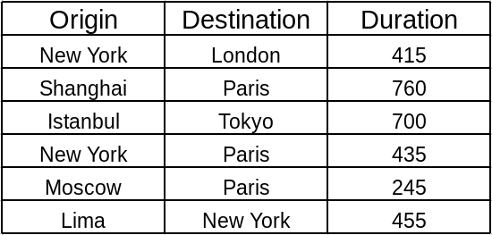

PostgreSQL Commands
===================
สามารถใช้งานได้ดังนี้ 3 วิธีดังนี้

1. การใช้งานผ่านทาง sql shell (psql) connect database ด้วย psql

.. code-block:: bash

    psql -U postgres postgres
    postgres=# CREATE DATABASE testdb1;
    postgres=# CREATE USER dbadmin1;
    postgres=# ALTER USER dbadmin1 WITH password 'password';
    postgres=# GRANT ALL PRIVILEGES ON DATABASE testdb1 to dbadmin1;
    postgres=# CREATE USER dbadmin2 WITH PASSWORD 'password';
    postgres=# \du
    postgres=# \q

    (connect database ชื่อ testdb1 ด้วย user dbadmin1)
    [root@localhost ~]# psql -U dbadmin1 testdb1
    Password for user dbadmin1:
    psql (10.2)
    Type "help" for help.

    testdb1=>

2. การใช้งานผ่านคำสั่ง createdb command ผ่านทาง linux shell

การสร้าง user ผ่านคำสั่ง createuser และ การสร้างฐานข้อมูลผ่านคำสั่ง createdb

.. code-block:: bash

    [root@localhost ~]# createuser --help

    [root@localhost ~]# createuser -P -s -d dbadmin3 -U postgres
    Enter password for new role:
    Enter it again:
    Password: (ใส่ password ของ postgres )

    [root@localhost ~]# createdb --help
    [root@localhost ~]# createdb --owner=dbadmin3 -U postgres  testdb3
    Password: (ใส่ password ของ postgres )

    [root@localhost ~]# psql -U dbadmin3
    Password for user dbadmin3:
    psql: FATAL:  database "dbadmin3" does not exist
    (error เพราะ postgres จะพยายาม เปิด database ชื่อเดียวกับ user)

    [root@localhost ~]## psql -U dbadmin3 -d testdb3
    Password for user dbadmin3:
    psql (10.2)
    Type "help" for help.

    testdb3=# \l
                                List of databases
    Name    |  Owner   | Encoding |   Collate   |    Ctype    |   Access privileges
    -----------+----------+----------+-------------+-------------+-----------------------
    postgres  | postgres | UTF8     | en_US.UTF-8 | en_US.UTF-8 |
    template0 | postgres | UTF8     | en_US.UTF-8 | en_US.UTF-8 | =c/postgres          +
    |          |          |             |             | postgres=CTc/postgres
    template1 | postgres | UTF8     | en_US.UTF-8 | en_US.UTF-8 | =c/postgres          +
    |          |          |             |             | postgres=CTc/postgres
    testdb1   | postgres | UTF8     | en_US.UTF-8 | en_US.UTF-8 |
    testdb3   | dbadmin3 | UTF8     | en_US.UTF-8 | en_US.UTF-8 |

สรุปคำสั่งเบื้องต้น
----------------

* ``testdb1=> \du``  แสดงรายชื่อ user
* ``postgres=# \l``  แสดงฐานข้อมูลทั้งหมด
* ``postgres=# \dt``  แสดงฐานข้อมูลทั้งหมด
* ``postgres=# \c``   database`` connect กับฐานข้อมูล

.. code-block:: bash

    [root@localhost ~]# psql -U dbadmin1 testdb1
    Password for user dbadmin1:
    psql (10.2)
    Type "help" for help.

    testdb1=> \du
                                       List of roles
     Role name |                         Attributes                         | Member of
    -----------+------------------------------------------------------------+-----------
     davide    |                                                            | {}
     dbadmin1  |                                                            | {}
     dbadmin3  | Superuser, Create role, Create DB                          | {}
     jonathan  |                                                            | {}
     postgres  | Superuser, Create role, Create DB, Replication, Bypass RLS | {}

    testdb1=> \l
                                      List of databases
       Name    |  Owner   | Encoding |   Collate   |    Ctype    |   Access privileges
    -----------+----------+----------+-------------+-------------+-----------------------
     postgres  | postgres | UTF8     | en_US.UTF-8 | en_US.UTF-8 |
     template0 | postgres | UTF8     | en_US.UTF-8 | en_US.UTF-8 | =c/postgres          +
               |          |          |             |             | postgres=CTc/postgres
     template1 | postgres | UTF8     | en_US.UTF-8 | en_US.UTF-8 | =c/postgres          +
               |          |          |             |             | postgres=CTc/postgres
     testdb1   | postgres | UTF8     | en_US.UTF-8 | en_US.UTF-8 | =Tc/postgres         +
               |          |          |             |             | postgres=CTc/postgres+
               |          |          |             |             | dbadmin1=CTc/postgres
     testdb3   | dbadmin3 | UTF8     | en_US.UTF-8 | en_US.UTF-8 |
    (5 rows)

    testdb1=> \c testdb3
    You are now connected to database "testdb3" as user "dbadmin1".
    testdb3=>

ตัวอย่าง 1 สร้างตาราง
---------------------
* สร้างตาราง ``employees`` ประกอบด้วย colume employee_id, first_name, last_name
* ``CREATE TABLE employees (employee_id int, first_name varchar, last_name varchar);``
* เพิ่ม record
* ``INSERT INTO employees VALUES (1, 'John', 'Doe');``

.. code-block:: bash

    testdb3=> CREATE TABLE employees (employee_id int, first_name varchar, last_name varchar);
    testdb3=> INSERT INTO employees VALUES (1, 'John', 'Doe');

    testdb3=> \d employees
                     Table "public.employees"
    Column    |       Type        | Collation | Nullable | Default
    -------------+-------------------+-----------+----------+---------
    employee_id | integer           |           |          |
    first_name  | character varying |           |          |
    last_name   | character varying |           |          |

    testdb3=> SELECT * FROM employees;
    testdb3=> \dt
           List of relations
     Schema |   Name    | Type  |  Owner
    --------+-----------+-------+----------
     public | employees | table | dbadmin1
     (1 row)

Information_schema meta data
----------------------------
ใช้คำสั่ง SELECT ค้นหาชื่อ colume name จากตาราง ``information_schema``  meta-data

.. code-block:: bash
   :linenos:

   SELECT
     COLUMN_NAME
   FROM
     information_schema.COLUMNS
   WHERE
     TABLE_NAME = 'employees';

แสดง tables ใช้ pg_catalog schema
-----------------------------------

.. code-block:: bash
   :linenos:

   SELECT
     *
   FROM
     pg_catalog.pg_tables
   WHERE
     schemaname != 'pg_catalog'
   AND schemaname != 'information_schema';

ตัวอย่าง 2 สายการบิน
---------------------
ตัวอย่าง ด้านล่าง แสดงเส้นทางการเดินระหว่างเมืองพร้อมระยะทาง

Postgresql data type
---------------------
.. image:: _static/images/pgsql-datatype.png

CREATE TABLE
------------

* สร้างไฟล์ ชื่อ ``flight-createtable.sql`` มีเนื้อหาดังต่อไปนี้

.. literalinclude:: _static/code/flight-createtable.sql

มีการกำหนด constraint ``NOT NULL`` ในไฟล์ เพื่อป้องกันค่าว่าง (ไม่กำหนดค่า)

เป็น sql syntax เมื่อ import เข้าสู่ฐานข้อมูล ก็ถูกแปลความ สามารถที่จะนำเข้าสู่ database
ได้ 2 แบบ ได้แก่การใช้การ ``<`` หรือจะ copy โดยตรงไปยัง postgres shell ก็ได้

.. code-block:: bash

    [root@localhost ~]# psql -U dbadmin3 testdb3  < flight-createdb.sql
    Password for user dbadmin3:
    CREATE TABLE

    สามารถใช้ option ``-c`` เพื่อส่งคำส่งไปยัง postgres shell
    [root@localhost ~]# psql -U dbadmin3 testdb3  -c "\d"
    Password for user dbadmin3:
                   List of relations
     Schema |      Name      |   Type   |  Owner
    --------+----------------+----------+----------
     public | employees      | table    | dbadmin1
     public | flights        | table    | dbadmin3
     public | flights_id_seq | sequence | dbadmin3

INSERT TABLE
------------
รูปแบบ sql syntax::

    INSERT INTO TABLE_NAME (column1, column2, column3,...columnN)
    VALUES (value1, value2, value3,...valueN);

.. literalinclude:: _static/code/flight-insert.sql

run::

    [root@localhost ~]# psql -U dbadmin3 testdb3  -c "select * from flights"
    Password for user dbadmin3:
     id |  origin  | destination | duration
    ----+----------+-------------+----------
      1 | New York | London      |      415
      2 | Shanghai | Paris       |      760
      3 | Istanbul | Tokyo       |      700
      4 | New York | Paris       |      435
      5 | Moscow   | Paris       |      245
      6 | Lima     | New York    |      455
    (6 rows)

SELECT and WHERE
----------------
รูปแบบ sql syntax::

    SELECT column1, column2, columnN
    FROM table_name
    WHERE [CONDITION | EXPRESSION];

การใช้งานจะใช้งานร่วมกัน ระหว่าง Comparison และ Logical

PostgreSQL Comparison Operators
-------------------------------

.. image:: _static/images/operator.png

PostgreSQL Logical Operators
-----------------------------

.. image:: _static/images/logical.png

run::

    SELECT * FROM flights WHERE duration > 500;
     id |  origin  | destination | duration
    ----+----------+-------------+----------
      2 | Shanghai | Paris       |      760
      3 | Istanbul | Tokyo       |      700
    (2 rows)

    SELECT * FROM flights WHERE destination = 'Paris'
    id |  origin  | destination | duration
    ----+----------+-------------+----------
     2 | Shanghai | Paris       |      760
     4 | New York | Paris       |      435
     5 | Moscow   | Paris       |      245
    (3 rows)

    SELECT * FROM flights WHERE destination = 'Paris' AND  duration > 500;
     id |  origin  | destination | duration
    ----+----------+-------------+----------
      2 | Shanghai | Paris       |      760
    (1 row)

Aggregate Functions
-------------------
Aggregate function คือการคำนวนแล้วได้ผลลัพท์ เพียงอย่างเดียว จากการคำนวนของชุดข้อมูล ชุดใดๆ

.. image:: _static/images/aggregate.png

* ต้องการหาค่าเฉลี่ย ``avg``

run::

    SELECT AVG(duration) FROM flights;
             avg
    ----------------------
     501.6666666666666667
    (1 row)

    SELECT AVG(duration) FROM flights WHERE origin='New York';
         avg
    ----------------------
     425.0000000000000000
    (1 row)

* ต้องการนับจำนวน record ``count``

run::

    SELECT COUNT(*) FROM flights;
     count
    -------
         6
    (1 row)
    SELECT COUNT(*) FROM flights WHERE origin = 'New York';
     count
    -------
         2
    (1 row)
    SELECT COUNT(*) FROM flights WHERE origin = 'Moscow';
     count
    -------
         1
    (1 row)

* ต้องการหาค่า ต่ำสุด และ สูงสุด

run::

    testdb3=# SELECT MIN(duration) FROM flights;
     min
    -----
     245
    (1 row)

    testdb3=# SELECT MAX(duration) FROM flights;
     max
    -----
     760
    (1 row)

IN, NOT IN CONDITION
--------------------
postgres สามารถค้นหา ด้วย ``IN condition``
รูปแบบ sql syntax::

    expression IN (value1, value2, .... value_n);

run::

    testdb3=# SELECT * FROM flights WHERE origin IN ('New York', 'Lima');
     id |  origin  | destination | duration
    ----+----------+-------------+----------
      1 | New York | London      |      415
      4 | New York | Paris       |      435
      6 | Lima     | New York    |      455
    (3 rows)

    testdb3=# SELECT * FROM flights WHERE origin NOT IN ('New York', 'Lima');
     id |  origin  | destination | duration
    ----+----------+-------------+----------
      2 | Shanghai | Paris       |      760
      3 | Istanbul | Tokyo       |      700
      5 | Moscow   | Paris       |      245
    (3 rows)

LIKE, NOT LIKE
--------------
รูปแบบ sql syntax::

    string LIKE pattern
    string NOT LIKE pattern

run::

    testdb3=# SELECT * FROM flights WHERE origin LIKE '%a%';
     id |  origin  | destination | duration
    ----+----------+-------------+----------
      2 | Shanghai | Paris       |      760
      3 | Istanbul | Tokyo       |      700
      6 | Lima     | New York    |      455
    (3 rows)

.. warning::

    Like ใช้ได้กับ text หากต้องการ ค้นหา Attributes ที่เป็น integer ต้องทำการ cast
    เป็น text ด้วย ``::TEXT``

run::

    testdb3=# SELECT * FROM flights WHERE duration LIKE '%7%';

    testdb3=# SELECT * FROM flights WHERE duration::TEXT LIKE '%7%';
     id |  origin  | destination | duration
    ----+----------+-------------+----------
      2 | Shanghai | Paris       |      760
      3 | Istanbul | Tokyo       |      700
    (2 rows)

UPDATE
------
รูปแบบ sql syntax::

    UPDATE table_name
    SET column1 = value1, column2 = value2...., columnN = valueN
    WHERE [condition];

ใช้สำหรับการปรับปรุงค่าของ Attributes

run::

    UPDATE flights
        SET duration = 430
        WHERE origin = 'New York'
        AND destination = 'London';

run::

    testdb3=# UPDATE flights
    testdb3-# SET duration = 430
    testdb3-# WHERE origin = 'New York'
    testdb3-# AND destination = 'London';
    UPDATE 1

DELETE
------
รูปแบบ sql syntax::

    DELETE FROM table_name
    WHERE [condition];

run::

    DELETE FROM flights WHERE origin = 'New York';

LIMIT
-----
จำกัด จำนวนผลลัพท์ ที่ได้จาก query

run::

    testdb3=# SELECT * FROM flights LIMIT 2;
     id |  origin  | destination | duration
    ----+----------+-------------+----------
      2 | Shanghai | Paris       |      760
      3 | Istanbul | Tokyo       |      700
    (2 rows)

ORDER
-----
เรียงลำดับผลลัพท์ โดย เลือก attribute เรียงจากน้อยไปหามาก ASC หรือเรียงจากมากไปหาน้อย DSC

run::

    testdb3=# SELECT * FROM flights ORDER BY duration ASC;
     id |  origin  | destination | duration
    ----+----------+-------------+----------
      5 | Moscow   | Paris       |      245
      1 | New York | London      |      430
      4 | New York | Paris       |      435
      6 | Lima     | New York    |      455
      3 | Istanbul | Tokyo       |      700
      2 | Shanghai | Paris       |      760
    (6 rows)

    testdb3=# SELECT * FROM flights ORDER BY duration ASC LIMIT 3;
     id |  origin  | destination | duration
    ----+----------+-------------+----------
      5 | Moscow   | Paris       |      245
      1 | New York | London      |      430
      4 | New York | Paris       |      435
    (3 rows)

    testdb3=# SELECT * FROM flights ORDER BY duration DESC;
     id |  origin  | destination | duration
    ----+----------+-------------+----------
      2 | Shanghai | Paris       |      760
      3 | Istanbul | Tokyo       |      700
      6 | Lima     | New York    |      455
      4 | New York | Paris       |      435
      1 | New York | London      |      430
      5 | Moscow   | Paris       |      245
    (6 rows)

GROUP BY
--------
โดยส่วนมากใช้งานร่วมกับ aggregate fuction  SUM, COUNT , HAVE
รูปแบบ sql syntax::

    SELECT column-list
    FROM table_name
    WHERE [ conditions ]
    GROUP BY column1, column2....columnN
    ORDER BY column1, column2....columnN

run::

    testdb3=# SELECT origin FROM flights GROUP BY origin;
      origin
    ----------
     Shanghai
     Moscow
     Istanbul
     New York
     Lima
    (5 rows)

    testdb3=# SELECT origin,COUNT(*)  FROM flights GROUP BY origin;
      origin  | count
    ----------+-------
     Shanghai |     1
     Moscow   |     1
     Istanbul |     1
     New York |     2
     Lima     |     1
    (5 rows)

    testdb3=# SELECT origin,COUNT(*)  FROM flights GROUP BY origin
    testdb3-# HAVING COUNT(*) > 1;
      origin  | count
    ----------+-------
     New York |     2
    (1 row)

Foreign Keys
------------

พิจารณาตารางที่ได้เพิ่มเติม โค้ดสนามบิน

.. image:: _static/images/flights-code.png

เมื่อเราแยก ตารางออกมาได้ 2 ตารางดังนี้

.. image:: _static/images/flights-code-norm.png

และเพิ่มเติมตารางผู้โดยสารที่โดยสายการบิน

.. image:: _static/images/flights-passengers.png

* สร้างตาราง location, flight, passengers ดังนี้
    * vim flight-passengers.sql

.. literalinclude:: _static/code/flight-passengers.sql

* Insert ข้อมูลในฐานข้อมูล database
    * สร้าง ไฟล์ ``vim flight-data.sql`` ด้วยข้อมูลด้านล่างนี้

.. literalinclude:: _static/code/flight-data.sql
