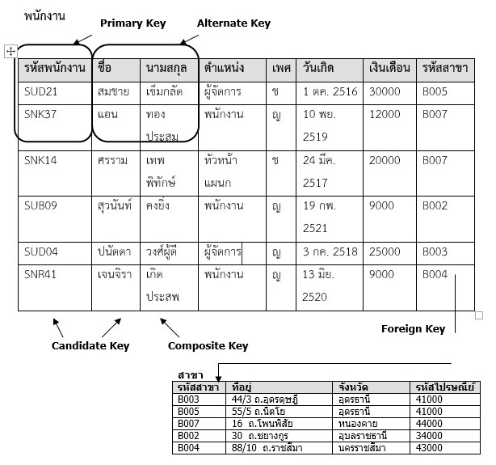
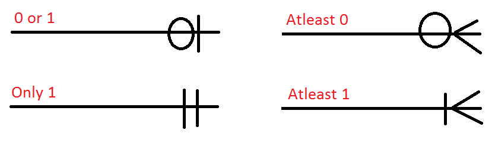
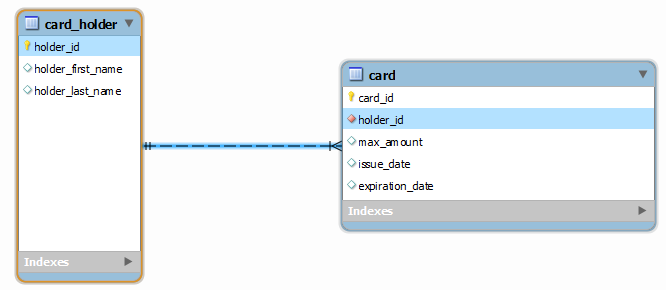
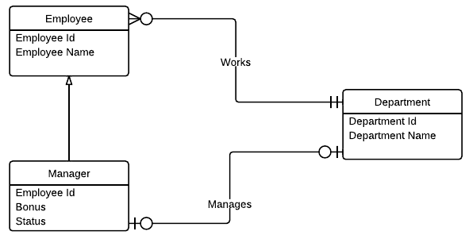
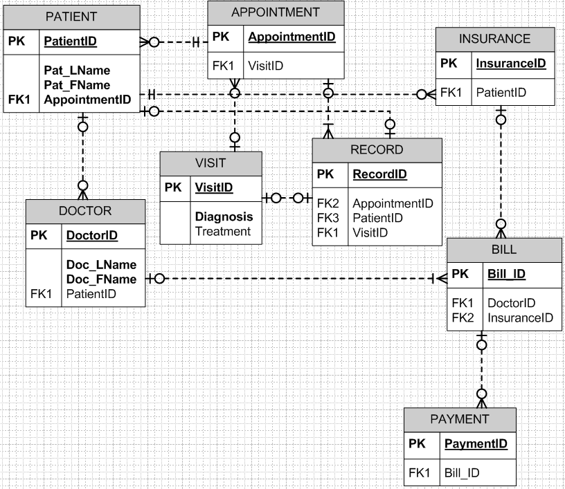

Relational Database
===================

การจัดเก็บฐานข้อมูลเชิงสัมพันธ์ ได้เริ่มรู้จักกัน บทความชื่อ A Relational Model of Data for Large
Shared Data Banks  ของ Dr.Edgar Frank Codd  หรือ Dr. E. F. Codd ซึ่งขณะนั้นเป็นนักวิจัยอยู่ที่บริษัท
IBM ได้ตีพิมพ์ในวารสาร Association of Computer Machinery (ACM) journal เมื่อเดือนมิถุนายน
ปี ค.ศ.1970   การสร้างโมเดลเชิงสัมพันธ์ได้ใช้ทฤษฎีทางคณิตศาสตร์เกี่ยวกับเซต (Set) มาอธิบายการทำงาน
แนวคิดของ Codd นี้ได้ถูกพัฒนาเป็นซอฟต์แวร์ระบบฐานข้อมูลที่ชื่อว่า Oracle จากบริษัท Relational Software
หรือ บริษัท Oracle ในปัจจุบัน

.. image:: _static/images/edgar.png

ความหมายของศัพท์ที่เกี่ยวข้อง

+-----------------------------------+---------------------------------------------------------------------------------+
| คำศัพท์                           |  ความหมาย                                                                       |
+===================================+=================================================================================+
| รีเลชั่น (Relation)               | ตาราง (Table) แสดงความจริง ชุดหนึ่ง ที่แทนข้อมูล และไม่สามารถซ้ำกันได           |
+-----------------------------------+---------------------------------------------------------------------------------+
| ทูเพิล  (  Tuple )                | ค่าของข้อมูลในแต่ละแถว  (  Row  ) หรือ  เรคคอร์ด ( Record )                     |
+-----------------------------------+---------------------------------------------------------------------------------+
| คาร์ดินาลลิตี้   ( Cardinality  ) | จำนวนแถวแต่ละข้อมูลในแต่ละรีเลชั่น                                              |
+-----------------------------------+---------------------------------------------------------------------------------+
| แอทริบิวต์  (  Attribute  )       | รายละเอียดของข้อมูลในแต่ละคอลัมน์  รู้จักในรูปของคอลัมน์  (  Column  )          |
+-----------------------------------+---------------------------------------------------------------------------------+
|  คีย์หลัก   (  Primary  key  )    | แอทริบิวต์ที่มีค่าของข้อมูลเป็นเอกลักษณ์หรือะจะเป็นค่าที่ไม่ซ้ำกันในแต่ละทูเพิล |
+-----------------------------------+---------------------------------------------------------------------------------+
| โดเมน (  Domain  )                | ขอบเขตของค่าของข้อมูลที่ควรจะเป็นในแต่ละแอทริบิวต์                              |
+-----------------------------------+---------------------------------------------------------------------------------+

คุณสมบัติของความสัมพันธ์ (รีเลชัน) Relation
-------------------------------------------

1. Relation หรือ ตาราง ต้องมีชื่อไม่ซ้ำกัน
2. แต่ละฟิลด์จะเก็บประเภทข้อมูลชนิดเดียว
3. ข้อมูลในแต่ละ Tuple (row หรือ record) จะต้องไม่ซ้ำกัน อาจมีการเปลี่ยนแปลงได้
4. ข้อมูลแต่ละ Tuple แทนความจริง (Fact)
5. Column หรือ ฟิลด์ สามารถสลับกันได้

โมเดลฐานข้อมูลเชิงสัมพันธ์ ผู้ริเริ่มคือ Dr.E.F.Codd โดยกำหนดส่วนประกอบของโมเดลเชิงสัมพันธ์แบ่งเป็น 3 ส่วนได้แก่

1. ส่วนที่เกี่ยวข้องกับโครงสร้างของข้อมูล
2. ส่วนที่เกี่ยวกับการควบคุมความถูกต้องให้กับข้อมูล
3. ส่วนในการจัดการกับข้อมูล

1. โครงสร้างของข้อมูลเชิงสัมพันธ์ (Relational Data Structure)

.. image:: _static/images/struct.jpg

กุญแจ (key)
----------
กุญแจ หรือ คีย์ (Key) สิ่งที่ใช้กำหนดความเป็นเอกลักษณ์ในความสัมพันธ์

1. คีย์หลัก (PK: Primary Key) หรือ กุญแจหลัก (PK เป็นคีย์คู่แข่ง candidate key ตัวหนึ่งที่ถูกเลือกขึ้นมาเป็นคีย์หลัก)
คุณสมบัติของคีย์หลัก คือ มีความเป็นหนึ่งเดียว ค่าของคีย์หลักต้องไม่ซ้ำกันเลย ประกอบด้วยจำนวนแอททริบิวต์น้อยที่สุด
ที่สามารถเจาะจงทัพเพิลหนึ่งในรีเลชันได้ (PK ห้ามซ้ำ)

2. คีย์รอง ( Alternate Key หรือ Secondary Key) กุญแจที่ไม่ถูกเลือกให้เป็นกุญแจหลัก

3. คีย์นอก (FK: Foreign Key) ใช้ในการเชื่อมโยงข้อมูลระหว่างความสัมพันธ์เข้าด้วยกัน FK เป็น primary key
ใน relation อื่น

4. คีย์อย่างง่าย (Simple key) ประกอบด้วย attribute เดียว

5. คีย์ประกอบ (Combine key หรือ Composite key) กุญแจที่ประกอบขึ้นจากแอททริบิวท์มากกว่า 1 แอททริบิวท์
เมื่อนำแอททริบิวต์ทั้งหมดมาผสมกัน  ทำให้ได้ค่าที่ไม่ซ้ำกันเลย

6. คีย์คู่แข่ง (Candidate Key) สามารถจะเป็นคู่แข่งซึ่งจะถูกเลือกให้เป็นคีย์หลัก

7. ซุปเปอร์คีย์ (Super key) กลุ่มของแอททริบิวต์ของรีเลชันที่สามารถเจาะจง (identify) ความเป็นหนึ่งเดียวของ tuple
ที่แตกต่างจากทัพเพิลอื่นได้  หมายถึง attribute หรือ เซ็ทของ attribute ที่สามารถบ่งบอกว่าแต่ละแถว (Tuple)
แตกต่างกัน ในทุก ๆ ความสัมพันธ์ จะต้องมีอย่างน้อย หนึ่ง Super key ในเซ็ทของ attributes

แอททริบิวต์ (Attribute)
--------------------------
แอททริบิวต์ (Attribute) หมายถึง แต่ละคอลัมน์ที่อยู่ในรีเลชัน แต่ละแอททริบิวต์จะมีชื่อกำกับแต่ละแอททริบิวต์ในต่ละรีเลชัน

.. image:: _static/images/attribute.jpg

ดีกรี (Degree)
--------------

ดีกรี (Degree) หมายถึง  จำนวนแอททิริบิวท์ของแต่ละตาราง(รีเลชัน) หรือ จำนวนแอททิริบิวท์ที่มีอยู่ในแต่ละตาราง(รีเลชัน)

คาร์ดินัลลิตี้ (Cardinality)
-----------------------------
คาร์ดินัลลิตี้ (Cardinality) หมายถึง การอ้างถึงลักษณะความสัมพันธ์ของข้อมูลของตารางกับอีกตารางหนึ่ง
Cardinality หมายถึง จำนวนที่มากที่สุดในความสัมพันธ์ อย่างน้อยมีได้ 1 หรือมีได้ไม่จำกัด many

โมเดลลิตี้(Modality)
-------------------
โมเดลลิตี้(Modality) หมายถึงจำนวนที่น้อยที่สุดในความสัมพันธ์ มีได้แค่สอง option เท่านั้น คืออย่างน้อยที่สุดเป็น 0 และ อย่างน้อยที่สุดเป็น 1

Entity-Relationship Diagram
---------------------------

ในแต่ละความสัมพันธ์ จะต้องระบุจำนวน Cardinality และ Modality คู่กันเพื่อกำหนดจำนวนที่น้อยที่สุดและมากที่สุด

.. image:: _static/images/modality3.png

ทั้งสองค่าสร้างความเป็นไปได้ดังนี้

ลองดูตัวอย่าง ผู้ถือบัตรเครดิต และ บัตรเครดิต ถ้ากำหนดให้ผู้ถือบัตร ถือบัตรได้แค่ ใบเดียว ก็จะเป็น one-to-one แต่หาก กำหนดให้ผู้ถือบัตรถือได้มากกว่า 1 ใบ ก็จะแทนด้วย one-to-many

.. image:: _static/images/options.png

เมื่อแสดงกับ class Model (one-to-one)

.. image:: _static/images/credit.png

เมื่อแสดงกับ class Model (one-to-many)

ตัวอย่าง
---------

* ความสัมพันธ์ ระหว่างแผนกและพนักงาน

* วิเคราะห์ฐานข้อมูลโรงพยาบาล

2. ส่วนที่เกี่ยวกับการควบคุมความถูกต้องให้กับข้อมูล
---------------------------------------------

2.1 กฎความคงสภาพของเอนทิตี (Entity Integrity Rule)

* คีย์หลักของรีเลชั่น จะต้องมีค่าข้อมูลที่ไม่ซ้ำกัน (unique)

    เนื่องจากคุณสมบัติของคีย์หลัก จะเป็นแอททริบิวท์ที่ใช้ในการเจาะจงแถวข้อมูลใดแถวข้อมูลหนึ่งในรีเลชัน
    ดังนั้นจึงจะให้ค่าข้อมูลที่ซ้ำกันไม่ได้

* ค่าข้อมูลของคีย์หลักจะต้องไม่เป็นค่าว่าง (Null Value)
    จะต้องไม่มีแอททริบิวท์ใดที่เป็นส่วนประกอบของคีย์หลักของรีเลชันนั้นเป็นค่าว่าง เพราะค่าของข้อมูลในคีย์หลัก
    จะถูกใช้เจาะจงถึงข้อมูลแถวใด ๆ ในรีเลชัน

2.2 กฎความคงสภาพของการอ้างอิง (Referential Integrity Rule)

    ถ้ารีเลชันใดมีแอททริบิวท์ที่เป็นคีย์นอกอยู่ ข้อมูลที่เป็นคีย์นอกนั้นจะต้องไปปรากฏเป็นข้อมูลของคีย์หลักของอีกรีเลชัน
    ที่มีความสัมพันธ์กัน หรืออาจให้ข้อมูลที่เป็นคีย์นอกนั้นจะต้องมีค่าเป็นค่าว่าง

3. การจัดการกับข้อมูล (Data manipulation)
-------------------------------------------

Dr. E.F. Codd ได้นำทฤษฎีของเซท (set) ซึ่งเป็นทฤษฎีทางคณิตศาสตร์มาใช้ในการจัดการกับข้อมูลของฐาน
เชิงสัมพันธ์ โดยเซท หมายถึง คำที่ใช้บ่งบอกถึงกลุ่มของสิ่งต่างๆ และเมื่อกล่าวถึงกลุ่มใดแน่นอนว่าสิ่งใดอยู่ใน
กลุ่มสิ่งใดไม่อยู่ในกลุ่ม ตัวอย่าง

ให้ A เป็นเซตของผลไม้, A = {สับปะรด, ทุเรียน, มังคุด, ลำไย, ลิ้นจี่}   จำนวนสมาชิกของ A, n(A)=5 และ

ให้ B เป็นเซตสีของรุ้ง จะได้ B = {สีม่วง, สีคราม, สีน้ำเงิน, สีเขียว, สีเหลือง, สีแสด, สีแดง} และ n(B)=7

การจัดการกับข้อมูล (Data manipulation) ได้แก่

* ยูเนียน (Union) ใช้สัญลักษณ์ (∪) เชื่อมความสัมพันธ์เข้าด้วยกัน คือ การแสดงข้อมูลตามลักษณะทฤษฎีการUnionของเซต กล่าวได้ว่ายูเนียนของ A และ B คือเซตที่เกิดจากการรวบรวมสมาชิกของ A และ B เข้าไว้ด้วยกัน

* อินเตอร์เซกชัน (Intersection) คือ โอเปอเรเตอร์ทางคณิตศาสตร์ที่ใช้ในการแสดงข้อมูลที่มีอยู่ในทั้งสองรีเลชั่นหรือมากกว่า โดยรีเลชั่นที่จะมา Intersection กันจะเป็นรีเลชั่นที่ไปกันได้ กล่าวได้ว่า อินเตอร์เซกชันของ A และ B คือเซตที่ประกอบด้วยสมาชิกที่เหมือนกันของ A และ B

* ผลต่างระหว่างเซต (Difference Set) (Minus) ใช้สัญลักษณ์ (-) หาความแตกต่างระหว่างความสัมพันธ์คือ การแสดงข้อมูลทูเพิลของรีเลชัน ซึ่งไม่มีอยู่ในอีกรีเลชันหนึ่ง ตามทฤษฎีการ Difference ของเซตกล่าวได้ว่า ผลต่างระหว่างเซต A และเซต B คือสมาชิกอยู่ในเซต B โดย“ ผลต่างระหว่างเซต A และเซต Bเขียนแทนด้วย A – B ”

* Join Operator คือ การกระทำเพื่อแสดงข้อมูลที่เป็นไปได้ทั้งหมดที่เกิดจากการเชื่อมโยงข้อมูลของ 2 รีเลชั่น

* Division คือ การแสดงข้อมูลจากสองรีเลชั่น โดยที่รีเลชั่นทั้งสองมีแอททริบิวต์อย่างน้อยหนึ่งแอททริบิวต์ที่เหมือนกันผลลัพธ์ที่ได้ จะเป็นค่าของแอททริบิวต์จากรีเลชั่นที่มีจำนวนแอททริบิวต์มากกว่า

* แบบมีข้อจำกัด (Restrict) คือ การแสดงข้อมูลในทูเพิล ซึ่งมีข้อมูลตรงตามเงื่อนไขที่ระบุ หากมีการปรับปรุง (Update)หรือลบ(Delete) ข้อมูลในกุญแจหลักของรีเลชันหลัก(Parent relation) ที่มีข้อมูลที่เป็นกุญแจนอกอ้างอิงอยู่ในขณะนั้น จะไม่สามารถปรับปรุงหรือลบข้อมูลดังกล่าวได้ ตัวอย่างเช่น หากต้องการแก้ไข “รหัสสาขา” ในรีเลชัน “สาขา” จาก “B005” เป็น B050” (หรือต้องการลบ สาขาที่มีรหัส “B005” ออกจากรีเลชัน “สาขา”) จะไม่สามารถทำได้หากมีการอ้างถึงข้อมูล “B005” ในแอททริบิวท์ “รหัสสาขา” ในรีเลชัน “พนักงาน” (ซึ่งทำหน้าที่เป็นกุญแจนอก)  จะแก้ไขได้ก็ต่อเมื่อ ไม่มีการอ้างถึงข้อมูลดังกล่าวในกุญแจนอกของรีเลชัน “พนักงาน” แล้ว
